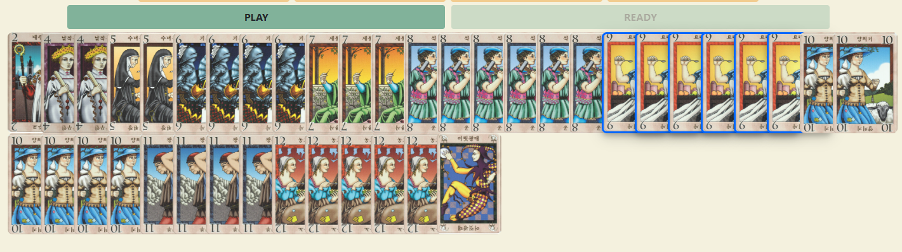

## The Great Dalmuti (Card game v2)

<h2>Main Features</h2>

- Game room function, chat, private rooms.
- Participants can be admitted as spectators according to the game start state of each room.
- Entry is not allowed in case of overcrowding.
- The game continues even if one user disconnect.
- Real cards and real rules!
- 3 differents language (English, Italian, Bulgarian).
- Responsive Design.
- Leaderboard for ranking that update after every match.
- Icon for every role plus pay taxes.

<a href="https://dalmuti-v1.herokuapp.com/"  style="font-weight:bold; font-size:30px;text-decoration:none;">Play for free!</a>

Credits to the guy who started this project <a href="https://github.com/vlwkaos/simplified-dalmuti">vlwkaos/simplified-dalmuti</a>